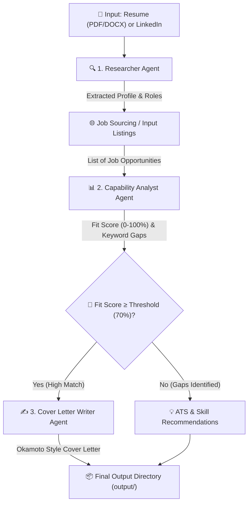

# AI Job Hunting Agent Pipeline

An intelligent multi-agent pipeline powered by Google Gemini that analyzes candidate profiles (resumes, LinkedIn), evaluates job opportunity fit, identifies ATS & skill gaps, and generates targeted cover letters written in Rebecca Okamoto's narrative style.

---

## 📋 Features

- **Profile Researcher Agent**: Parses candidate resumes (`.docx`, `.pdf`, `.txt`) and LinkedIn profiles to extract core competencies, leadership experience, and AI/technical skill sets.
- **Capability Analyst Agent**: Evaluates job descriptions against candidate profiles, computes a fit score (0–100%), performs ATS keyword gap analysis, and recommends targeted skill improvements.
- **Cover Letter Writer Agent**: Automatically generates customized, high-impact cover letters using Rebecca Okamoto's TED Talk methodology for jobs meeting the fit threshold (default $\ge 70\%$).
- **Interactive & Automated CLI**: Supports both interactive prompt-guided setup and fully automated batch runs.

---

## ⚙️ Prerequisites

- **Python**: `3.10` or higher
- **API Key**: Google Gemini API key (`GEMINI_API_KEY` or `GOOGLE_API_KEY`)

---

## 🚀 Quick Start & Installation

### 1. Clone or Open Project Directory
Navigate to the project root directory in your shell:
```bash
cd Job_Hunting
```

### 2. Set Up Virtual Environment (Recommended)
```bash
# Windows (PowerShell)
python -m venv venv
.\venv\Scripts\Activate.ps1

# Linux / macOS
python3 -m venv venv
source venv/bin/activate
```

### 3. Install Dependencies
```bash
pip install -r requirements.txt
```

### 4. Configure Environment Variables
Create a `.env` file in the root directory (or copy from your environment):
```env
GEMINI_API_KEY=your_gemini_api_key_here
```
*(Alternatively, set `GOOGLE_API_KEY=your_key_here` in your environment).*

---

## 🏃 Running the Program

### Option A: Interactive Mode
Run the pipeline with interactive prompts for your target roles, LinkedIn URL, and resume path:
```bash
python main.py
```

### Option B: Quick Sample Mode (Default Inputs)
Run without interactive prompts, using default sample candidate data:
```bash
python main.py --sample
```

### Option C: Custom CLI Parameters
Specify custom resume files, roles, or job sources directly via CLI flags:
```bash
python main.py --resume "path/to/my_resume.docx" \
               --roles "Program Manager, Supply Chain Manager" \
               --linkedin "https://www.linkedin.com/in/yourprofile" \
               --jobs "sample_data/jobs_sample.json"
```

---

## 📖 CLI Arguments Reference

| Flag | Short / Type | Description | Default |
| :--- | :--- | :--- | :--- |
| `--sample` | flag | Runs automatically with default inputs without prompting for user confirmation. | `False` |
| `--resume` | string | Path to candidate resume file (`.docx`, `.pdf`, `.txt`). | `2025_Dec10  L Sabnani PMv2.docx` |
| `--linkedin`| string | LinkedIn Profile URL. | `https://www.linkedin.com/in/lalitsabnani` |
| `--roles` | string | Comma-separated list of target job roles. | `Program Manager, Supply Chain Analyst, Materials Program Manager` |
| `--jobs` | string | Path to JSON file containing job listings. | `sample_data/jobs_sample.json` |

---

## 📂 System Architecture & Workflow



---

## 📁 Output Artifacts

Upon completion, all generated reports and cover letters are saved in the `output/` directory:
- **`pipeline_summary.json`**: Complete execution report with candidate profile data, match analysis scores, gap recommendations, and generated cover letters.
- **`cover_letter_<JobTitle>_<Company>.txt`**: Formatted cover letters for qualifying positions.
