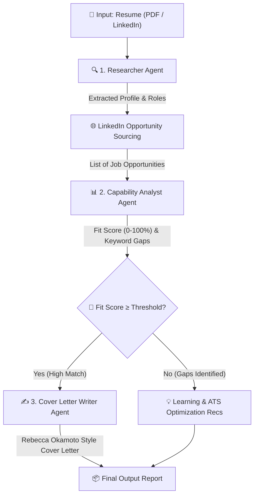

# Job Hunting AI Agent Pipeline - Architecture & Workflow

This document details the system design, flow of data, and responsibilities for each agent in the Job Hunting AI Agent Pipeline, derived from [`spec.md`](file:///c:/Users/Lalit.MSI/Documents/Education/AntiGravity/ai-agent-experiments/Job_Hunting/spec.md).

> [!TIP]
> You can view the interactive rendered diagram in Chrome via [`architecture_viewer.html`](file:///c:/Users/Lalit.MSI/Documents/Education/AntiGravity/ai-agent-experiments/Job_Hunting/architecture_viewer.html).

---

## 🔄 End-to-End Workflow Diagram

---

## 🤖 Agent Components & Specifications

### 1. Researcher Agent
- **User Prompting**: Interactively asks the user for target roles of interest (defaults to *Program Manager*, *Supply Chain Analyst*, *Materials Program Manager*), LinkedIn Profile URL (defaults to `https://www.linkedin.com/in/lalitsabnani`), and resume file path (defaults to `2025_Dec10  L Sabnani PMv2.docx`).
- **Input Processing**: Reads and parses incoming LinkedIn profile data or uploaded PDF/DOCX resumes.
- **Profile Extraction**: Extracts target roles, core skills (including AI tools, digital transformation, product ownership, project leadership), and work history.
- **Opportunity Sourcing**: Sources available job opportunities matching target roles across platforms including LinkedIn, `job-list.csv` imports, Indeed.com, Glassdoor.com, etc.

### 2. Capability Analyst Agent
- **Fit Scoring**: Calculates a compatibility score (0-100%) by comparing candidate experience against job requirements. Displays explicit LinkedIn profile or Resume source evaluated.
- **Gap Analysis**: Identifies missing keywords and experience gaps.
- **Skill Development**: Recommends online courses, certifications, or classes to bridge capability gaps.
- **ATS Resume Optimization**: Suggests specific keyword placements or modifications to help the candidate pass automated screening filters.

### 3. Cover Letter Writer Agent
- **Trigger**: Activated for job matches meeting or exceeding the fit threshold.
- **Style & Narrative**: Employs Rebecca Okamoto's TED Talk strategy (focusing on bold positioning, personal value proposition, dynamic storytelling, and strategic clarity).
- **Core Pillars Highlighted**:
  1. Digital transformation skills
  2. Product ownership / management experience
  3. Passion for building and leading successful projects
  4. Hands-on experience in using AI tools

---

## 📁 Related Files & Artifacts
- **System Specification**: [`spec.md`](file:///c:/Users/Lalit.MSI/Documents/Education/AntiGravity/ai-agent-experiments/Job_Hunting/spec.md)
- **Implementation Plan**: [`implementation_plan.md`](file:///c:/Users/Lalit.MSI/Documents/Education/AntiGravity/ai-agent-experiments/Job_Hunting/implementation_plan.md)
- **Interactive Chrome Viewer**: [`architecture_viewer.html`](file:///c:/Users/Lalit.MSI/Documents/Education/AntiGravity/ai-agent-experiments/Job_Hunting/architecture_viewer.html)
