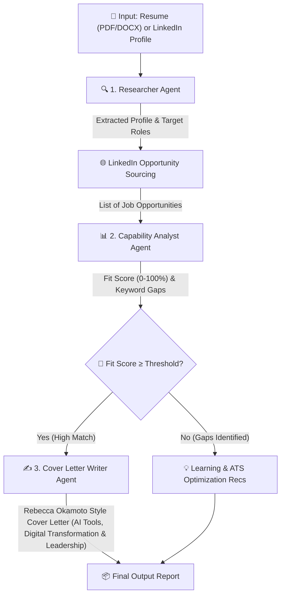

# Implementation Plan - Update Job Hunting Agent using Revised Spec

Update the Job Hunting Agent codebase to fully align with all requirements in the revised [`spec.md`](file:///c:/Users/Lalit.MSI/Documents/Education/AntiGravity/ai-agent-experiments/Job_Hunting/spec.md), with particular focus on the updated Cover Letter Writer Agent specifications (adding AI tools experience, project leadership passion, digital transformation, and product ownership/management), system defaults, and capability feedback outputs.

## Architecture & Workflow

---

## User Review Required

> [!IMPORTANT]
> The revised spec explicitly expands the Cover Letter Writer Agent requirements to highlight:
> 1. Digital transformation skills
> 2. Product ownership/management experience
> 3. Passion for building and leading successful projects
> 4. Hands-on experience in using AI tools
>
> We will update the prompt templates, fallback text generators, pipeline outputs, and system architecture docs to incorporate these changes.

---

## Proposed Changes

### Core Agent Logic

#### [MODIFY] [`agents/writer.py`](file:///c:/Users/Lalit.MSI/Documents/Education/AntiGravity/ai-agent-experiments/Job_Hunting/agents/writer.py)
- Update LLM style prompt and structured parameters to mandate highlighting:
  - Digital transformation skills
  - Product ownership/management experience
  - Passion for building and leading successful projects
  - Experience in using AI tools
- Update the fallback template to incorporate AI tools usage and project leadership passion alongside product ownership and digital transformation.

#### [MODIFY] [`agents/researcher.py`](file:///c:/Users/Lalit.MSI/Documents/Education/AntiGravity/ai-agent-experiments/Job_Hunting/agents/researcher.py)
- Refine rule-based extraction fallback and LLM prompts to ensure AI tools experience, digital transformation, and project leadership capabilities are captured in core skills when present.
- Confirm defaults align strictly with spec (`https://www.linkedin.com/in/lalitsabnani` and `2025_Dec10  L Sabnani PMv2.docx`).

#### [MODIFY] [`agents/analyst.py`](file:///c:/Users/Lalit.MSI/Documents/Education/AntiGravity/ai-agent-experiments/Job_Hunting/agents/analyst.py)
- Verify `source_used` tracking to show the exact LinkedIn profile URL or Resume file used for evaluation.
- Ensure keyword filtering, gap identification, course recommendations, and ATS resume keyword tuning accurately assess candidate capabilities against job postings.

---

### Pipeline Orchestrator & CLI Entrypoint

#### [MODIFY] [`pipeline.py`](file:///c:/Users/Lalit.MSI/Documents/Education/AntiGravity/ai-agent-experiments/Job_Hunting/pipeline.py)
- Ensure generated cover letters pass through updated writer agent logic and are written to disk cleanly.
- Verify summary output JSON contains all evaluation sources and structured results.

---

### Documentation & Architecture Visualizer

#### [MODIFY] [`architecture_and_workflow.md`](file:///c:/Users/Lalit.MSI/Documents/Education/AntiGravity/ai-agent-experiments/Job_Hunting/architecture_and_workflow.md)
- Update Cover Letter Writer Agent specifications in documentation to list all four key narrative pillars: digital transformation, product ownership, project leadership passion, and AI tools experience.

#### [MODIFY] [`architecture_viewer.html`](file:///c:/Users/Lalit.MSI/Documents/Education/AntiGravity/ai-agent-experiments/Job_Hunting/architecture_viewer.html)
- Update HTML diagram and text descriptions for the Cover Letter Writer Agent to reflect the updated spec.

---

## Verification Plan

### Automated Tests & CLI Execution
- Run `python main.py --sample` to execute the pipeline end-to-end on the default resume (`2025_Dec10  L Sabnani PMv2.docx`).
- Verify that generated output files in `output/` (`output_report.json`, cover letter markdown files) contain the updated Rebecca Okamoto style cover letters with AI tools and project leadership highlights.

### Manual Verification
- Review the generated cover letters and summary report to verify compliance with [`spec.md`](file:///c:/Users/Lalit.MSI/Documents/Education/AntiGravity/ai-agent-experiments/Job_Hunting/spec.md).
